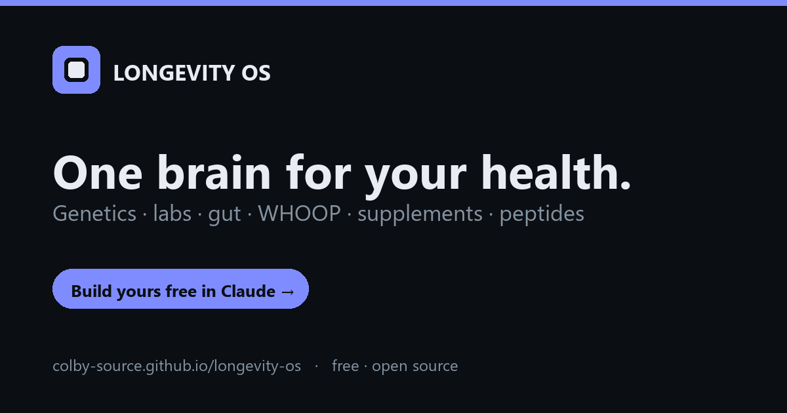

# Longevity OS

An all-in-one **personal longevity dashboard** — genetics, lab biomarkers, gut microbiome, WHOOP biometrics, supplements, peptides, nutrition, fitness, and an AI coach, unified into one clean brain.

**▶ Live demo:** https://colby-source.github.io/longevity-os/

> **Sample data.** This public demo uses de-identified, illustrative numbers — it is **not a real person's records** and is **not medical advice**. Educational only.

## 🧠 Build YOUR version — in your own Claude (nothing installed, nothing stored)
The demo shows sample data. To get **your** dashboard, you use **Claude** as the engine: upload your own health files (WHOOP export, labs, DNA, gut report, supplement photos) and Claude reads them, builds your personalized dashboard, and becomes your coach. Your data stays in **your** Claude account.

**→ Full step-by-step guide: [`setup/SETUP_GUIDE.md`](setup/SETUP_GUIDE.md)**  ·  10 minutes, no coding.

- **Have Claude Pro?** Create a Project with [`setup/PROJECT_INSTRUCTIONS.md`](setup/PROJECT_INSTRUCTIONS.md) + [`setup/dashboard-template.html`](setup/dashboard-template.html).
- **Free Claude?** Paste [`setup/MASTER_PROMPT.md`](setup/MASTER_PROMPT.md) into a new chat and upload your files.

Then say **"build my dashboard"** → Claude parses everything and renders your real numbers.

**Want live WHOOP sync + an API-powered coach?** See **[`setup/INTEGRATIONS.md`](setup/INTEGRATIONS.md)** — how to create your own WHOOP developer app, add your Claude API key, and connect Oura/CGM later. *(That's the full self-hosted app; the no-code guide above uses file exports and works today.)*

## What it shows
- **Command Center** — biological age (PhenoAge), longevity score, today's readiness, top flags
- **Vitals** — HRV / recovery / sleep architecture / strain (WHOOP)
- **Labs** — biomarkers with optimal-range bars, grouped by system, re-graded flags
- **Genetics** — variants wired to ongoing monitoring rules
- **Gut** — Viome scores + personalized food engine
- **Protocol / Supplements / Peptides** — timing, interactions, days-left, reconstitution calculator
- **Nutrition** — meal plan + photo macro tracker + budget-aware grocery sourcing
- **Fitness** — training load, HR-zone distribution, weekly plan
- **Suggestions** — ranked across all data, including supplement/peptide overlaps
- **Trends** — bio-age PhenoAge breakdown + interactive N-of-1 correlation engine
- **AI Doctor** — grounded coach chat (demo replies; wires to the Claude API in the full build)

## Make it yours
- Swap the floating call-to-action link: in `index.html`, replace `https://YOUR-LINK-HERE` with your community / link-in-bio URL.
- It's a single self-contained file — no build step, no dependencies.

## Deploy
GitHub Pages serves `index.html` at the repo root. Any static host (Netlify, Vercel, Cloudflare Pages) works the same — drop the one file.

## License
MIT — see [LICENSE](LICENSE).
